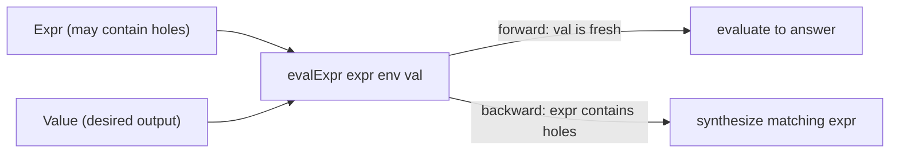

import { Aside } from '@astrojs/starlight/components';

`staged.nix` implements a **relational expression interpreter**. The same `evalExpr`
goal can evaluate an expression to a value, or — run backward — synthesize expressions
that produce a desired value. Logic variables in expression positions act as **holes**
to be filled by search.

## The Expr type

An expression is one of four Nix attrset shapes:

| shape | meaning |
|---|---|
| `{ atom = v; }` | literal value `v` |
| `{ ref = "name"; }` | environment lookup |
| `{ add = [e1 e2]; }` | arithmetic addition |
| `{ attrs = { k = expr; … }; }` | attrset construction |

A **hole** is a logic variable placed in any position — including inside `atom` or as
the `ref` name. The interpreter propagates constraints until the hole is determined by
the available information.

```nix
# forward: evaluate { add = [{atom=3} {atom=4}] } → 7
run 1 (q: evalExpr { add = [{atom=3;} {atom=4;}]; } {} q)
# => [ 7 ]

# backward: which atom produces 7?
run 1 (q: evalExpr { atom = q; } {} 7)
# => [ 7 ]
```

## `evalExpr expr env val`

The relational interpreter. All three arguments can contain logic variables.

- **`atom`** — unifies `expr.atom` with `val` directly.
- **`ref`** — walks `expr.ref` in the substitution to get a name, then looks up `env.name` and unifies with `val`.
- **`add`** — recursively evaluates both sub-expressions to `a` and `b`, then calls `wrapAdd a b val`.
- **`attrs`** — for each key `k`, recursively evaluates `expr.attrs.k` to a fresh variable, then unifies the assembled attrset with `val`.

```nix
# evaluate a ref expression
run 1 (q: evalExpr { ref = "x"; } { x = 10; } q)
# => [ 10 ]

# synthesize an attrset
run 1 (q: evalExpr { attrs = { a = { atom = 1; }; b = { atom = 2; }; }; } {} q)
# => [ { a = 1; b = 2; } ]
```

## `wrapAdd a b val`

Bidirectional arithmetic. Given any two of the three values it solves for the third:

| known | solved | operation |
|---|---|---|
| `a`, `b` | `val` | `val = a + b` |
| `a`, `val` | `b` | `b = val - a` |
| `b`, `val` | `a` | `a = val - b` |
| none ground | — | deferred (returns `null`) |

```nix
# forward
run 1 (q: wrapAdd 3 4 q)   # => [ 7 ]

# backward: 3 + ? = 7
run 1 (q: wrapAdd 3 q 7)   # => [ 4 ]

# backward: ? + 4 = 7
run 1 (q: wrapAdd q 4 7)   # => [ 3 ]
```

<Aside type="note">
`wrapAdd` defers (returns `null` / empty stream) when fewer than two of the three
arguments are ground. In a larger conjunction, later goals may ground the remaining
argument and retry.
</Aside>

## Holes in synthesis

Place a fresh logic variable anywhere in an expression tree to leave a hole for search:

```nix
# find a literal that, added to 3, gives 10
run 1 (q:
  fresh (hole:
    conj
      (evalExpr { add = [{ atom = 3; } { atom = hole; }]; } {} 10)
      (eq q hole)))
# => [ 7 ]
```

Holes work at any depth. An entire sub-expression can be a variable — the interpreter
will enumerate `atom`, `ref`, and `add` forms that satisfy the constraint when used
with `disj`.

## Forward vs backward



## Use case: program-by-example

Given input–output pairs, find an `Expr` consistent with all of them:

```nix
# find expr such that eval(expr, {x=1}) = 2 and eval(expr, {x=2}) = 3
run 1 (q:
  conj
    (evalExpr q { x = 1; } 2)
    (evalExpr q { x = 2; } 3))
# => [ { add = [{ ref = "x"; } { atom = 1; }] } ]
```

The search tries all structurally consistent `Expr` shapes. Combined with `weight`
annotations on `disj` branches, `wrun` returns the **simplest** consistent program first.

<Aside type="tip">
Use `wrun` instead of `run` when synthesizing programs. Weight each expression
constructor by its complexity (e.g., `atom` = 0, `add` = 1) to prefer smaller results.
</Aside>
