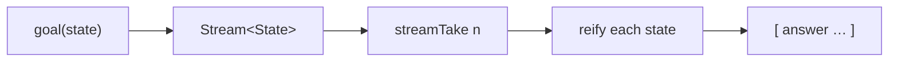

import { Aside, Card, CardGrid, LinkCard } from '@astrojs/starlight/components';

ukanrenix is a μKanren implementation written entirely in Nix — no external tools, no
imports beyond the Nix standard library. It lets you write **relational programs** that
run forward (evaluate) or backward (synthesize), enumerate multiple answers, rank them by
cost, and enforce constraints — all as lazily-evaluated Nix expressions.

## Why relational programming in Nix?

Nix already describes configuration as data. Relational programming lets you ask
questions about that data in both directions:

- **Enumerate configs** — given a schema, produce all valid option sets.
- **Synthesize selectors** — given a set of nodes and a desired match, find the minimal selector.
- **Rank completions** — given LLM candidate outputs and a cost model, return the cheapest valid one.

Standard Nix functions are one-directional: `f x = y`. A μKanren goal is a relation:
`goal` can find `x` given `y`, find `y` given `x`, or enumerate all pairs.

## Three core concepts

### Goals

A **goal** is a function from a search state to a stream of states:

```
goal : State -> Stream State
```

- `succeed` — the identity goal; passes the state through unchanged.
- `fail` — the zero goal; returns the empty stream.
- `eq a b` — unifies `a` and `b` in the current substitution.
- `conj g1 g2` — both goals must succeed (logical AND).
- `disj g1 g2` — either goal may succeed (logical OR, interleaved).
- `fresh f` — allocates a fresh logic variable and passes it to `f`.

### Unification

Unification extends the substitution map so that two terms become equal.
ukanrenix unifies over Nix's native types:

| Nix type | unification |
|---|---|
| scalars (`int`, `string`, `bool`, `null`) | structural equality |
| lists | element-wise, same length |
| attrsets | key-wise, same key set |
| logic var `{__var=true, id=n}` | binds the variable |

`unify` returns an extended substitution on success or `null` on failure.
`walk` chases variable chains to find a term's current binding.

### Run

`run n goalFn` is the top-level interface. It:

1. Starts from the empty state `{subst={}, counter=0}`.
2. Calls `goalFn` with a fresh query variable `q`.
3. Takes up to `n` states from the resulting stream.
4. Reifies each state — replaces logic variables with their bindings (or canonical `_.0` names for unbound vars).

```nix
run 3 (q: disj (eq q 1) (disj (eq q 2) (eq q 3)))
# => [ 1 2 3 ]
```

## Flow



## Quick example

```nix
let uk = import ./ukanren.nix {};
    inherit (uk) run eq fresh conj disj;
in

# What pairs [a b] satisfy a + b = 5, a ∈ {1,2,3}?
run 3 (q:
  fresh (a:
  fresh (b:
    conj
      (disj (eq a 1) (disj (eq a 2) (eq a 3)))
      (conj
        (uk.wrapAdd a b 5)
        (eq q [a b])))))
# => [ [1 4] [2 3] [3 2] ]
```

<Aside type="tip">
`fresh` allocates logic variables. `eq` unifies them. `conj`/`disj` combine goals.
`run` drives the search and reifies answers back into plain Nix values.
</Aside>

<CardGrid>
  <LinkCard title="μKanren in Nix" href="/explanation/ukanren" description="State, unification, streams, and the five core combinators." />
  <LinkCard title="Weighted Search" href="/explanation/semiring" description="Tropical semiring, weight annotation, and wrun." />
  <LinkCard title="Constraint Handling" href="/explanation/chr" description="typeOf, diseq, and custom deferred predicates." />
  <LinkCard title="Staged Evaluation" href="/explanation/staged" description="Relational expression interpreter with holes." />
</CardGrid>
